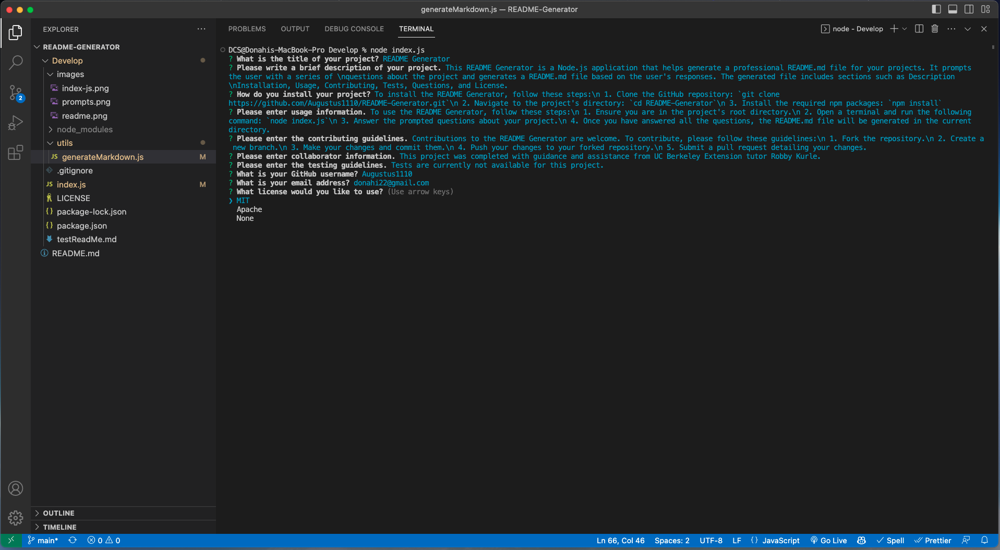
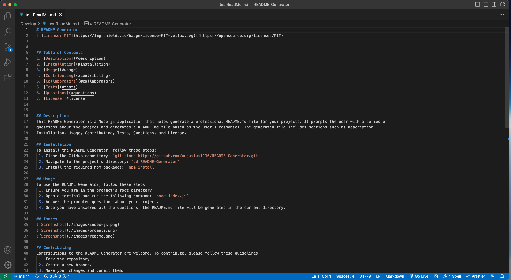

# ReadMe Generartor

## Table of Contents
1. [Description](#description)
2. [Installation](#installation)
3. [Usage](#usage)
4. [Contributing](#contributing)
5. [Tests](#tests)
6. [Questions](#questions)
7. [License](#license)

## Description
stuf

## Installation
stuff

## Usage
more stuff

## Images

## Contributing
ok

## Tests
yes

## Questions
If you have any questions, please contact me:

- GitHub: [no](https://github.com/no)
- Email: no

## License
MIT
(https://opensource.org/licenses/MIT)
