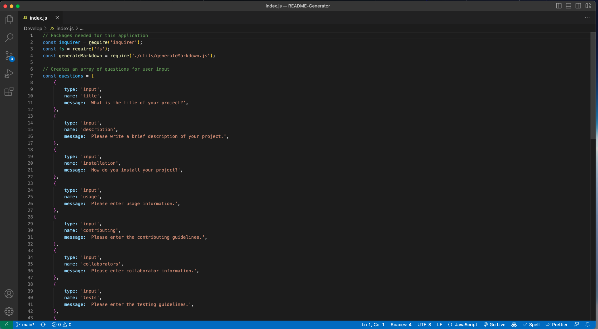
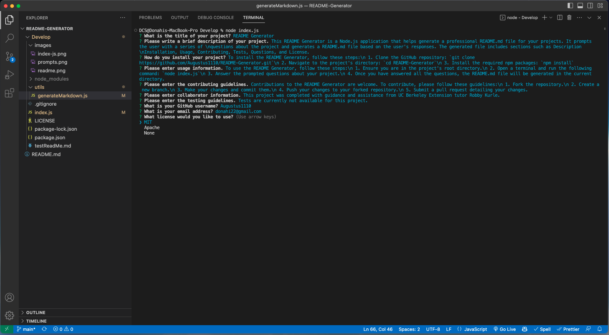
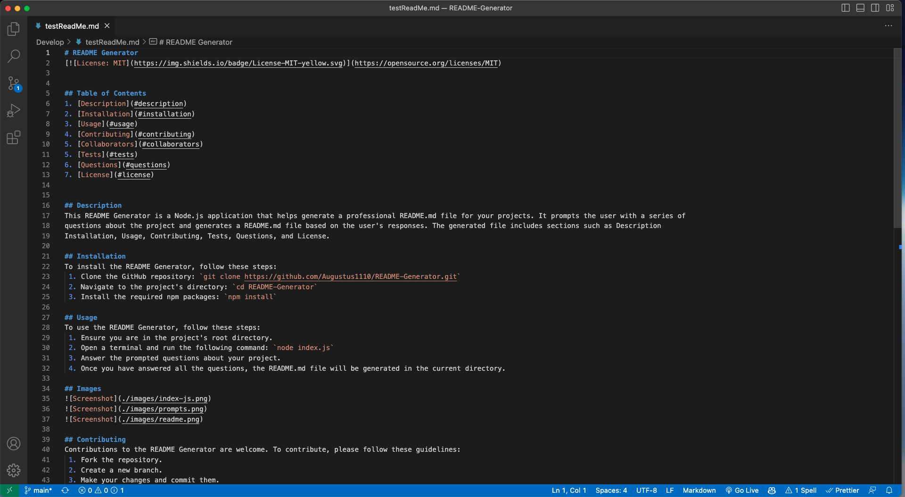

# README Generator

## Table of Contents
1. [Description](#description)
2. [Installation](#installation)
3. [Usage](#usage)
4. [Contributing](#contributing)
5. [Collaborators](#collaborators)
6. [Tests](#tests)
7. [Questions](#questions)
8. [License](#license)

## Description
This README Generator is a Node.js application that helps generate a professional README.md file for your projects. It prompts the user with a series of 
questions about the project and generates a README.md file based on the user's responses. The generated file includes sections such as Description 
Installation, Usage, Contributing, Tests, Questions, and License.

## Installation
To install the README Generator, follow these steps:
 1. Clone the GitHub repository: `git clone https://github.com/Augustus1110/README-Generator.git`
 2. Navigate to the project's directory: `cd README-Generator`
 3. Install the required npm packages: `npm install`

## Usage
To use the README Generator, follow these steps:
 1. Ensure you are in the project's root directory.
 2. Open a terminal and run the following command: `node index.js`
 3. Answer the prompted questions about your project.
 4. Once you have answered all the questions, the README.md file will be generated in the current directory.

## Images

## Contributing
Contributions to the README Generator are welcome. To contribute, please follow these guidelines:
 1. Fork the repository.
 2. Create a new branch.
 3. Make your changes and commit them.
 4. Push your changes to your forked repository.
 5. Submit a pull request detailing your changes.

## Collaborators
This project was completed with guidance and assistance from UC Berkeley Extension tutor Robby Kurle.

## Tests
Tests are currently not available for this project.

## Questions
If you have any questions, please contact me:

- GitHub: [Augustus1110](https://github.com/Augustus1110)
- Email: donahi22@gmail.com

## License
MIT
(https://opensource.org/licenses/MIT)
